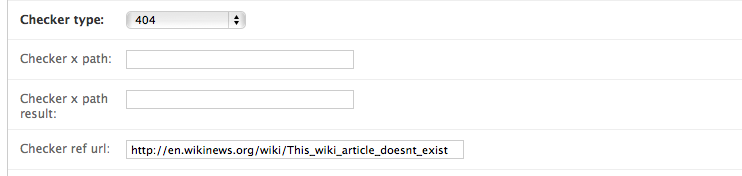
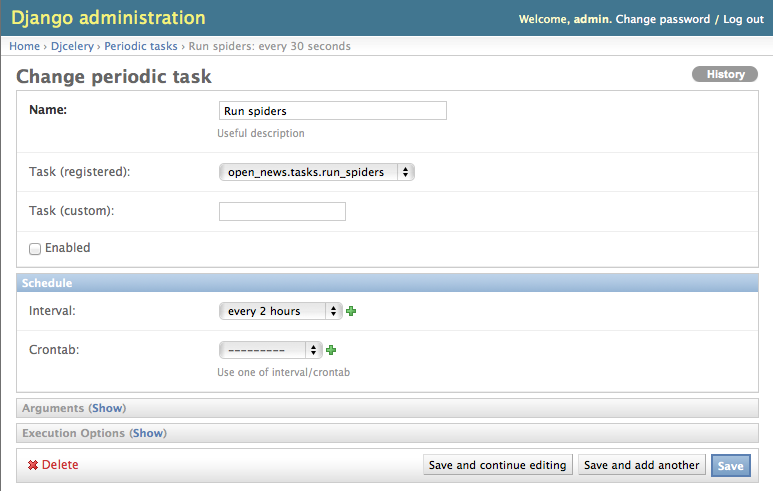
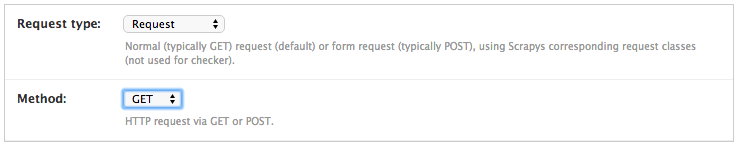
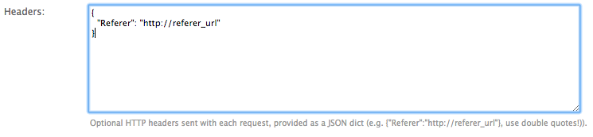
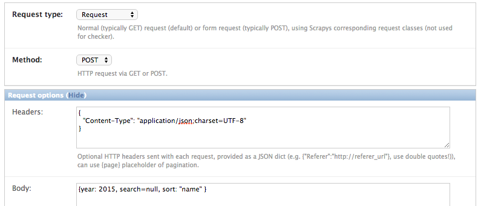
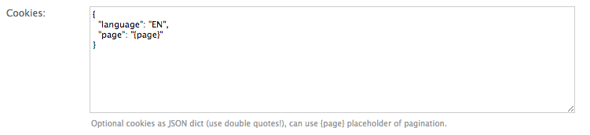
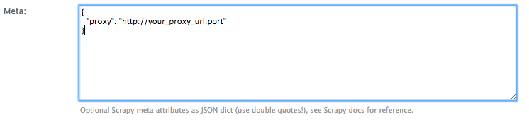
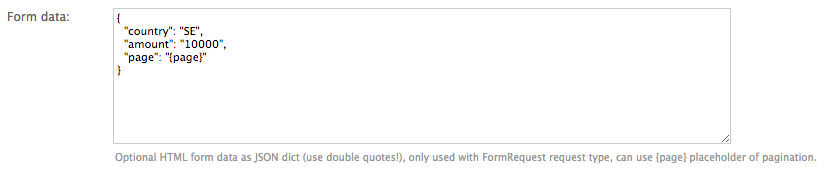
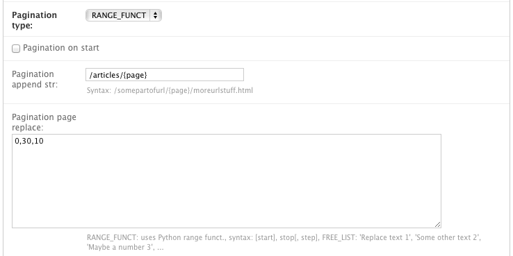

===============
Advanced topics
===============

.. _Wikinews: http://en.wikinews.org/wiki/Main_Page

.. _item_checkers:

Defining item checkers
======================

Django Dynamic Scraper comes with a built-in mechanism to check, if items once scraped are still existing
or if they could be deleted from the database. The entity providing this mechanism in DDS is called a 
``checker``. A ``checker`` is like a scraper also using the scraping logic from Scrapy. But instead of
building together a new scraped item, it just checks the detail page referenced by a ``DETAIL_PAGE_URL`` 
of a scraped item. Depending on the ``checker_type`` and the result of the detail page check, the scraped 
item is kept or will be deleted from the DB.

.. _creating_checker_class:

Creating a checker class
------------------------
To get a checker up and running you first have to create a checker class for each of your scraped object domain
models. In our open news example, this would be a class called ``ArticleChecker`` in a module called ``checkers``
in our ``scraper`` directory::

	from dynamic_scraper.spiders.django_checker import DjangoChecker
	from open_news.models import Article
	
	
	class ArticleChecker(DjangoChecker):
	    
	    name = 'article_checker'
	    
	    def __init__(self, *args, **kwargs):
	        self._set_ref_object(Article, **kwargs)
	        self.scraper = self.ref_object.news_website.scraper
	        #self.scrape_url = self.ref_object.url (Not used any more in DDS v.0.8.3+)
	        self.scheduler_runtime = self.ref_object.checker_runtime
	        super(ArticleChecker, self).__init__(self, *args, **kwargs)

The checker class inherits from the :ref:`django_checker` class from DDS and mainly gives the checker the
information what to check and what parameters to use for checking. Be careful that the reference object
is now the scraped object itself, since the checker is scraping from the item page url of this object.
Furthermore the checker needs its configuration data from the scraper of the reference object. The scheduler
runtime is used to schedule the next check. So if you want to use checkers for your scraped object, you have 
to provide a foreign key to a :ref:`scheduler_runtime` object in your model class. The scheduler runtime object
also has to be saved manually in your pipeline class (see: :ref:`adding_pipeline_class`).

Checker Configuration
---------------------
You can create one or more checkers per scraper in the ``Django admin``. A checker is connected to a
``DETAIL_PAGE_URL`` attribute and has a certain type, defining the checker behaviour. If you define
more than one checker for a scraper an item is deleted when one of the checkers succeed.

There are momentarily the following checker types to choose from:

================= =========================================================================
``404``           Item is deleted after check has returned 404 HTTP status code 2x in a row
``404_OR_X_PATH`` Same as 404 + check for an x_path value in the result
================= =========================================================================

For selecting a checker type and providing the parameters for an x_path checker 
you have to look for an example item page url from the website
to be scraped which references an item not existing any more. If the urls to your scraped items are build
using an item ID you can e.g. try to lower this ID or increase it to a very large number. Be creative!
In our Wikinews example it is a bit different, since the news article url there is build using the title of the
article. So for the checker we take a random article url to a not existing article:
"http://en.wikinews.org/wiki/Random_article_text".

If your url found is responding with a 404 when invoked, you can simply choose ``404`` as your checker type.
For a ``404_OR_X_PATH`` checker you have to provide an XPath 
for your chosen url which will extract a string from that url uniquely
indicating, that the content originally expected is not there any more. For our Wikinews example and the url
we choose above there is a text and a url provided suggesting to create the currently not existing wiki page,
so we can use the XPath ``//a[@href="http://en.wikinews.org/wiki/This_wiki_article_doesnt_exist"]/text()`` 
and the result string "create this page" to uniquely identifying a scraped item not existing any more.
It is also possible to leave out the result string. Then the checker already succeeds when the
given xpath is finding elements on the page. 

.. note:: Attention! Make sure that the XPath/result string combination you choose is NOT succeeding on normal
          item pages, otherwise the checker will delete all your items!
          
.. note:: 
   To make sure your items aren't deleted accidentally on a 404 response, 404 checks are only deleted on
   the second try while XPath checks are deleted at once. So to save crawling resources always try to realize
   your checking with XPath checks, otherwise the crawler need double the amount of checks!

Running your checkers
---------------------
You can test your DDS checkers the same way you would run your scrapers::

	scrapy crawl CHECKERNAME -a id=REF_OBJECT_ID [-a do_action=(yes|no) -a run_type=(TASK|SHELL)]

As a reference object ID you now have to provide the ID of a scraped item to be checked. With ``do_action=yes``
an item is really deleted, otherwise the checker is only tested without actually manipulating the DB.

If you want to test a check on an item scraped in the open news example project, change the url of the item in
the DB to the checker reference url, look for the item ID and then run::

	scrapy crawl article_checker -a id=ITEM_ID -a do_action=yes

If everything works well, your item should have been deleted.

.. _run_checker_tests:

Run checker tests
-----------------
Django Dynamic Scraper comes with a build-in scraper called ``checker_test`` which can be used to test your checkers
against the defined reference url. You can run this checker on the command line with the following command::

	scrapy crawl checker_test -a id=SCRAPER_ID
	
This scraper is useful both to look, if you have chosen a valid ``checker_x_path_ref_url`` and corresponding ``checker_x_path`` 
and ``checker_x_path_result`` values as well as to see over time if your reference urls stay valid.

For running all checker tests at once there exists a simple Django management command called ``run_checker_tests``,
which executes the ``checker_test`` scraper for all of your defined scrapers and outputs Scrapy log messages 
on ``WARNING`` level and above::

	python manage.py run_checker_tests [--only-active --report-only-errors --send-admin-mail]

The option ``only-active`` will limit execution to active scrapers, ``--report-only-errors`` will more
generously pass the test on some not so severe cases (e.g. a checker ref url returning ``404`` for a 
``404_OR_X_PATH`` checker type).
Executing the command with the ``--send-admin-mail`` flag will send an email to Django admins if checker 
configurations are not working which can be useful if you want to run this command as a cronjob.

Scheduling scrapers/checkers
============================

Introduction
------------
Django Dynamic Scraper comes with a build-in mechanism to schedule the runs of your scrapers as well as your
checkers. After each run DDS dynamically calculates the next execution time depending on the success of the run.
For a scraper that means, that the time between two scraper runs is shortened when new items could be scraped
from a page and is prolonged if not. For a checker, it means that a next check is prolonged if the check
was not successful, meaning that the item was not deleted. If it was deleted - well: than it was deleted! 
No further action! :-) The parameters for this calculation (e.g. a min/max time period between two actions)
are defined for each :ref:`scraped_obj_class` in the DB.

DDS is using django-celery_ to actually run your scrapers. Celery is a distributed task queue system for 
Python, which means that you can run a celery daemon which takes task orders from somewhere and then executes
the corresponding tasks in a sequential way so that no task is lost, even if the system is under heavy load.
In our use case Celery is "just" working as a comfortable cron job replacement, which can be controlled via
the Django admin interface. The scheduler of DDS is using the scheduler runtime objects we defined for our
example scraper and checker in the sections before. The scheduler runtime objects contain some dynamic
information for the calculation of the next execution time of the scraper as well as the next execution time
itself. For django-celery a task for each :ref:`scraped_obj_class` has to be defined, which can than be
started and stopped in the Django admin interface. Each task is executed periodically in a configurable
time frame (e.g. ever hour). The task is then running all the scrapers associated with its :ref:`scraped_obj_class`,
which next execution time lies in the past. After each run, the next next execution time is calculated
by the scraper and saved into its scheduler runtime object. The next time this time lies in the past,
the scraper is run again.

.. note::
   The number of spiders/checkers run at each task run is limited by the ``DSCRAPER_MAX_SPIDER_RUNS_PER_TASK``
   and ``DSCRAPER_MAX_CHECKER_RUNS_PER_TASK`` settings which can be adopted in your custom settings file (see: :ref:`settings`).

.. _installingcelery:

Installing/configuring django-celery for DDS
--------------------------------------------
This paragraph is covering only the specific installation issues with django-celery_ in regard of installing
it for the use with DDS, so you should be familiar with the basic functionality of Celery and take general
installation infos from the django-celery_ website. If you have successfully installed and configured 
django-celery, you should see the ``Djcelery`` tables in the Django admin interface:

.. image:: images/screenshot_django-admin_overview.png

For ``django-celery`` to work, Celery also needs a message broker for the actual message transport. For our
relatively simple use case, kombu_ is the easiest and recommended choice. Kombu is automatically installed
as a dependency when you install ``django-celery`` and you can add it to your ``INSTALLED_APPS``::

	INSTALLED_APPS = (
   	...
   	'kombu.transport.django',
   	'djcelery',
   )

Then we can configure django-celery_ in combination with kombu_ in our ``settings.py`` file. A starter
configuration could look similar to this::

	# django-celery settings
	import djcelery
	djcelery.setup_loader()
	BROKER_HOST = "localhost"
	BROKER_PORT = 5672
	BROKER_BACKEND = "django"
	BROKER_USER = "guest"
	BROKER_PASSWORD = "guest"
	BROKER_VHOST = "/"
	CELERYBEAT_SCHEDULER = 'djcelery.schedulers.DatabaseScheduler'

.. _django-celery: http://ask.github.com/django-celery/
.. _kombu: http://pypi.python.org/pypi/kombu

.. _definetasks:

Defining your tasks
-------------------
For defining tasks for your scrapers and checkers which can be selected for periodical runs in the Django
admin interface, you have to define two short methods in a Python module in which your tasks are declared and make
sure, that your tasks are found by django-celery_. The easiest way to do this is by placing your methods in a
module called ``tasks.py`` in the main directory of your app. The tasks should then be found automatically.
The two methods in our open news example look like this::

	from celery.task import task
	from django.db.models import Q
	from dynamic_scraper.utils.task_utils import TaskUtils
	from open_news.models import NewsWebsite, Article
	
	@task()
	def run_spiders():
	    t = TaskUtils()
	    #Optional: Django field lookup keyword arguments to specify which reference objects (NewsWebsite)
	    #to use for spider runs, e.g.:
	    kwargs = {
	        'scrape_me': True, #imaginary, model NewsWebsite hat no attribute 'scrape_me' in example 
	    }
	    #Optional as well: For more complex lookups you can pass Q objects vi args argument
	    args = (Q(name='Wikinews'),)
	    t.run_spiders(NewsWebsite, 'scraper', 'scraper_runtime', 'article_spider', *args, **kwargs)
	    
	@task()
	def run_checkers():
	    t = TaskUtils()
	    #Optional: Django field lookup keyword arguments to specify which reference objects (Article)
	    #to use for checker runs, e.g.:
	    kwargs = {
	        'check_me': True, #imaginary, model Article hat no attribute 'check_me' in example 
	    }
	    #Optional as well: For more complex lookups you can pass Q objects vi args argument
	    args = (Q(id__gt=100),)
	    t.run_checkers(Article, 'news_website__scraper', 'checker_runtime', 'article_checker', *args, **kwargs)

The two methods are decorated with the Celery task decorator to tell Celery that these methods should be
regarded as tasks. In each task, a method from the ``TaskUtils`` module from DDS is called to run the
spiders/checkers ready for the next execution.

Now you can create a peridoc task both for your scraper and your checker in the Django admin interface:

In the peridoc task form you should be able to select your tasks defined above. Create an interval how often
these tasks are performed. In our open news example, 2 hours should be a good value. Please keep in mind, that
these are not the values how often a scraper/checker is actually run. If you define a two hour timeframe here,
it just means, that ever two hours, the task method executed is checking for scrapers/checkers with a next
execution time (defined by the associated ``scheduler_runtime``) lying in the past and run these scrapers.
The actual time period between two runs is determined by the next execution time itself which is calculated
dynamically and depending on the scheduling configuration you'll learn more about below. For the scrapers to
run, remember also that you have to set the scraper active in the associated ``scraper`` object.

Run your tasks
--------------
To actually run the task (respectively set our scheduling system to work as a whole) we have to run two different
daemon processes. The first one is the ``celeryd`` daemon from django-celery_ which is responsible for collecting
and executing tasks. We have to run ``celeryd`` with the -B option to also run the celerybeat
task scheduler which executes periodical tasks defined in Celery. Start the daemon with::

	python manage.py celeryd -l info -B --settings=example_project.settings

If everything works well, you should now see the following line in your command line output::

	[2011-12-12 10:20:01,535: INFO/MainProcess] Celerybeat: Starting...

As a second daemon process we need the server from the separate ``scrapyd`` project 
to actually crawl the different websites targeted with our scrapers. 
Make sure you have deployed your Scrapy project (see: :ref:`setting_up_scrapy`) and run the
server with::

	scrapyd

You should get an output similar to the following:

	.. image:: images/screenshot_shell_scrapy_server.png 

For testing your scheduling system, you can temporarily set your time interval of your periodic task to
a lower interval, e.g. 1 minute. Now you should see a new task coming in and being executed every minute::

	Got task from broker: open_news.tasks.run_spiders[5a3fed53-c26a-4f8f-b946-8c4a2c7c5c83]
	Task open_news.tasks.run_spiders[5a3fed53-c26a-4f8f-b946-8c4a2c7c5c83] succeeded in 0.052549123764s: None
	 
The executed task should then run the scrapers/checkers which you should see in the output of the Scrapy
server::

	Process started: project='default' spider='article_spider' job='41f27199259e11e192041093e90a480a' pid=5932...
	Process finished: project='default' spider='article_spider' job='41f27199259e11e192041093e90a480a' pid=5932...
	
.. note:: 
   Note that you can vary the log level for debugging as well as other run parameters when you start
   the servers, see the man/help pages of the celery and the Scrapy daemons.
   
.. note::
   Please see this configuration described here just as a hint to get started. If you want to use
   this in production you have to provide extra measures to make sure that your servers run constantly and that
   they are secure. See the specific server documentation for more information.  

.. _`Scrapy Server`: http://doc.scrapy.org/en/0.14/topics/scrapyd.html

Scheduling configuration
------------------------
Now coming to the little bit of magic added to all this stuff with dynamic scheduling. The basis for the dynamic
scheduling in DDS is layed both for your scrapers and your checkers with the scheduling configuration parameters
in your scraped object class definitions in the Django admin interface. The default configuration for a 
scraper looks like this::

	"MIN_TIME": 15,
	"MAX_TIME": 10080,
	"INITIAL_NEXT_ACTION_FACTOR": 10,
	"ZERO_ACTIONS_FACTOR_CHANGE": 20,
	"FACTOR_CHANGE_FACTOR": 1.3,
	
Scheduling now works as follows: the inital time period between two scraper runs is calculated by taking the 
product of the ``MIN_TIME`` and the ``INITIAL_NEXT_ACTION_FACTOR``, with minutes as the basic time unit for 
``MIN_TIME`` and ``MAX_TIME``::

	initial time period := 15 Minutes (MIN_TIME) * 10 (INITIAL_NEXT_ACTION_FACTOR) = 150 Minutes = 2 1/2 Hours

Now, every time a scraper run was successful, the new next action factor is calculated by dividing the actual
next action factor by the ``FACTOR_CHANGE_FACTOR``. So a successful scraper run would lead to the following new
time period::

	new next action factor (NAF) := 10 (INITIAL_NEXT_ACTION_FACTOR) / 1.3 (FACTOR_CHANGE_FACTOR) = 7.69 (rounded)
	time period after successful run := 15 Minutes * 7.69 (NAF) = 115 Minutes
	
So if it turns out that your scraper always find new items the time period between two runs gets smaller and smaller
until the defined ``MIN_TIME`` is reached which is taken as a minimum time period between two scraper runs.
If your scraper was not successful (meaning, that no new items were found) these unsucessful actions (scraper runs) 
are counted as ``ZERO_ACTIONS``. If a number of unsuccessful actions greater than ``ZERO_ACTIONS_FACTOR_CHANGE`` 
is counted, a new next action factor is calculated, this time by taking the product of the actual action factor 
and the ``FACTOR_CHANGE_FACTOR`` (calculation restarting from initial values for the example)::

	new next action factor (NAF) := 10 (INITIAL_NEXT_ACTION_FACTOR) * 1.3 (FACTOR_CHANGE_FACTOR) = 13
	time period after 21 unsuccessful runs := 15 Minutes * 13 (NAF) = 195 Minutes
	
So the time period between two scraper runs becomes larger. If there is never a new item found for your scraper
this will go on until the calculated time period reaches the ``MAX_TIME`` defined.

In the real world application of this mechanism normally neither the ``MIN_TIME`` nor the ``MAX_TIME`` should be 
reached. The normal situation is that your scraper often finds nothing new on the page to be scraped and than 
after x executed runs finds new items provided on the website to be scraped. If this x is generally lower than 
your defined ``ZERO_ACTIONS_FACTOR_CHANGE`` number, the time period is becoming shorter over time. But since this 
means more scraper runs in the same time chances are high that with these narrower scheduled 
runs less zero actions occur and leads at some point to an again increased next action factor. So some kind of 
(relatively) stable next action factor should be reached over time, representing in the best case a good compromise 
between the needs of actuality of your scrapers and not to much resources wasted on running your scraper 
on websites not updated in between two runs.

.. note:: 
   Since this is a relatively complex mechanism also depending on a large part on the update process of your 
   scraped website, it will probably take some time to get a bit a feeling for how the scheduling is developing
   and to what action factors it tends to, so don't try to find the perfect solution in the first run. Instead,
   start with a (maybe rather too conservatively calculated) start configuration and adjust your parameters over
   time. You can observe the development of your action factors in the scheduler runtime objects.
         
.. note::
   Please be aware that scraping is a resource consuming task, for your server but as well for the server of
   the websites you are scraping. Try to find a balanced solution, not just setting your MIN_TIME to 1 minute
   or similar.
   
.. note::
   If you don't need dynamic scheduling, you can also just set the MIN_TIME and the MAX_TIME to the same 
   values and just ignore the rest.

Scheduling of your checkers works very similar to the scraper scheduling, the inital configuration is as follows::

	"MIN_TIME": 1440,
	"MAX_TIME": 10080,
	"INITIAL_NEXT_ACTION_FACTOR": 1,
	"ZERO_ACTIONS_FACTOR_CHANGE": 5,
	"FACTOR_CHANGE_FACTOR": 1.3,
 
Since the checker scheduling is terminated with the success of a checker run (meaning the item and the associated
scheduler runtime is deleted), there is only the prolonging time period part of the scheduler actually working.
So scraped items are checked in a (relatively, defined by your configuration) short time period at first.
If the item turns out to be persistently existing, the checks are prolonged till ``MAX_TIME`` is reached.

.. _advanced_request_options:

Advanced Request Options
========================

Since ``DDS v.0.7+`` you have more options to fine-tune your scraping requests by e.g. providing additional values for
``cookies`` or ``HTTP headers``. These values are internally passed to Scrapy's `Request object <http://doc.scrapy.org/en/latest/topics/request-response.html#request-objects>`_. You can find the extended request options in the 
``Request options`` tab in the ``Scraper form`` of your ``Django project admin``. For the different page types 
like the (paginated) main pages and the detail pages following scraped urls you can define different request options.

.. note::
   Parameters for the different options are passed as ``JSON`` dicts. Make sure to use ``double quotes``
   for attribute values and to leave the ``comma`` for the last attribute key-value pair.

Request Type and Method
-----------------------

The request type - corresponding to Scrapy's `Request classes <http://doc.scrapy.org/en/latest/topics/request-response.html#request-objects>`_ - and the type of the request being sent as ``GET`` or ``POST``. Normally you will choose ``GET``
together with a classic ``Request`` and ``POST`` with a ``FormRequest`` but for 
special cases you are free too choose here.

HTTP Headers
------------

For setting/changing specific ``HTTP header`` fields like the referer URL use the ``headers`` text field in the request options.

HTTP Body
---------

Setting/changing the ``HTTP body``. This can be useful for some special-case scenarios, for example if you want
to send a  ``POST`` request with content type for the request altered and sending ``POST`` parameters as a ``JSON`` dict.

.. note::
   Don't be fooled, especially by the example provided: data for the body attribute is NOT provided as ``JSON`` but
   as a ``string``. While e.g. the ``Headers`` field always has to be in ``JSON`` format, the ``Body`` text is just
   randomly ``JSON`` in this example, but it could also be ``This is my body text.``.

Request Cookies
---------------

Sometime the output of a website you want to scrape might depend on the values of some cookies sent to the server.
For this occasion you can use the ``Cookies`` form in the request options tab, e.g. for setting the language of a
website to ``english``.

You can also use the ``{page}`` placeholder. This placeholder is replaced for consecutive pages according
to your pagination parameters (see: :ref:`pagination`).

.. note::
   If you want to pass a ``session ID`` for a site as a ``cookie``, you can open the desired website in your browser 
   and copy-paste the session ID from the development console for immediately following scraper runs.

Scrapy Meta Options
-------------------

Changing Scrapy meta attributes, see
`Scrapy docs <doc.scrapy.org/en/latest/topics/request-response.html#topics-request-meta>`_ for reference.

Form Data
---------

If you want to scrape data provided on a website via a web form, data is often returned via ``POST`` request after
sending various ``POST request parameters`` for narrowing the results. For this scenario use the ``FormRequest`` request
type and ``POST`` as method in the scraper admin and provide the adequate form data as a JSON dictionary in the request options.

You can also use the ``{page}`` placeholder. This placeholder is replaced for consecutive pages according
to your pagination parameters (see: :ref:`pagination`).

.. _pagination:

Pagination
==========

Django Dynamic Scraper supports pagination for scraping your objects from several overview pages or archives.
The following screenshot shows the pagination parameters which can be defined in the Django admin 
for each scraper:

For using pagination you have to switch the ``pagination_type`` in your scraper definition from ``NONE`` to
your desired type. The main concept of pagination is, that you define a ``pagination_append_str`` with a
placeholder ``{page}``, which is replaced through a list generated by selecting the ``pagination_type`` and
giving a corresponding ``pagination_page_replace`` context. There are the following pagination types to
choose from:

Pagination type: RANGE_FUNCT
----------------------------
This pagination type uses the `python range function <http://docs.python.org/library/functions.html#range>`_.
As a replace context the same arguments like in the range function are used: ``range([start], stop[, step])``.
The integer list created by this function will be used as an input to replace the "{page}" template tag in the 
append string to form the different urls.

So the parameters in our example above in the screenshot will lead - together with "http://www.urltoscrape.org"
as the base scrape url of your scraper runtime - to the following urls to be scraped:

1. http://www.urltoscrape.org/articles/0
2. http://www.urltoscrape.org/articles/10
3. http://www.urltoscrape.org/articles/20
4. http://www.urltoscrape.org/articles/30

Pagination type: FREE_LIST
--------------------------
If the urls from an archive are formed differently you can use this pagination type and just provide a list
with different fitting replacements, the syntax is as follow: ``'Replace text 1', 'Some other text 2', 
'Maybe a number 3', ...``.

So if you define a list as follows: ``'a-d', 'e-h', 'i-n', 'o-z'``, you get the following urls:

1. http://www.urltoscrape.org/articles/a-d
2. http://www.urltoscrape.org/articles/e-h
3. http://www.urltoscrape.org/articles/i-n
4. http://www.urltoscrape.org/articles/o-z

.. _json_jsonpath_scrapers:

Scraping JSON content
=====================

Beside creating ``HTML`` or ``XML`` scrapers where you can use classic ``XPath`` notation, ``DDS`` supports also scraping pages encoded in ``JSON`` (``v.0.5.0`` and above), e.g. for crawling web APIs or ajax call result pages.

For scraping ``JSON``, ``JSONPath`` is used, an ``XPath``-like expression language for digging into ``JSON``.
For reference see expressions as defined here:

* `GitHub - python-jsonpath-rw Library <https://github.com/kennknowles/python-jsonpath-rw>`_
* `JSONPath - XPath for JSON <http://goessner.net/articles/JsonPath/>`_

.. note::
   Using ``JSONPath`` in ``DDS`` works for standard ``JSON`` page results, but is not as heavily tested as using
   ``XPath`` for data extraction. If you are working with more complex ``JSONPath`` queries and run into problems,
   please report them on `GitHub <https://github.com/holgerd77/django-dynamic-scraper>`_!

.. _scraping_images:

Scraping images/screenshots
===========================

Django Dynamic Scraper is providing a custom image pipeline build on Scrapy's `item pipeline for downloading
images <http://readthedocs.org/docs/scrapy/en/latest/topics/images.html>`_ to scrape and download images
associated to your items scraped and and save a reference to each image together with the scraped item in the DB.

Configuration
-------------
For using image scraping in DDS you have to provide some additional parameters in your Scrapy 
`settings.py` file::

	import os.path
	
	PROJECT_ROOT = os.path.abspath(os.path.dirname(__file__))
	
	ITEM_PIPELINES = [
	    'dynamic_scraper.pipelines.DjangoImagesPipeline',
	    'dynamic_scraper.pipelines.ValidationPipeline',
	    'open_news.scraper.pipelines.DjangoWriterPipeline',
	]
	
	IMAGES_STORE = os.path.join(PROJECT_ROOT, '../thumbnails')
	
	IMAGES_THUMBS = {
	    'small': (170, 170),
	}

In your settings file you have to add the ``DjangoImagesPipeline`` from DDS to your ``ITEM_PIPELINES`` and define
a folder to store images scraped. Don't forget to create this folder in your file system and give it adequate
permissions. You can also use the thumbnail creation capabilities already build in Scrapy
by defining the thumbnail size via the ``IMAGES_THUMBS`` parameter.

Choosing store format for images
--------------------------------
Different from Scrapy behaviour DDS is by default storing only one image in a flat store format directly under
the ``IMAGES_STORE`` directory (Scrapy is creating a ``full/`` subdirectory for the original image). If you use the
``IMAGES_THUMBS`` setting, the scaled down thumbnail image will replace the image with the original size.
Due to this simplification you can only use one entry in your ``IMAGES_THUMBS`` dictionary and the name of the 
key there doesn't matter. 

Starting with ``DDS v.0.3.9`` you can change this behaviour with the ``DSCRAPER_IMAGES_STORE_FORMAT`` setting::

	DSCRAPER_IMAGES_STORE_FORMAT = 'FLAT'   # The original image or - if available - one thumbnail image
	DSCRAPER_IMAGES_STORE_FORMAT = 'ALL'    # Both the original image and all given thumbnail sizes
	DSCRAPER_IMAGES_STORE_FORMAT = 'THUMBS' # Only the thumbnails

``FLAT`` is the default setting with the behaviour described above. The ``ALL`` setting restores the Scrapy behaviour,
the original images are stored in a ``full/`` directory under ``IMAGES_STORE``, thumbnail files - if available - in separate 
sub directories for different thumbnail sizes (e.g. ``thumbs/small/``).

Setting ``DSCRAPER_IMAGES_STORE_FORMAT`` to ``THUMBS``, keeps only the thumbnail files, this setting makes only sense 
with setting the ``IMAGES_THUMBS`` setting as well. With ``ALL`` or ``THUMBS`` you can also use different sizes for 
thumbnail creation.

.. note::
   Differing from the Scrapy output, an image is stored in the DB just by name, omitting path information like ``full/``

.. note:: 
   For image scraping to work you need the `Pillow Library (PIL fork) <https://python-pillow.github.io/>`_.

Updating domain model class/scraped obj class definition
--------------------------------------------------------
When Scrapy is downloading images it creates a new unique random file name for each image saved in your image
folder defined above. To keep a reference to the image associated with a scraped item DDS will save this filename
in a field you have to define in your model class. In our open news example, we use 'thumbnail' as a field name::

	class Article(models.Model):
	    title = models.CharField(max_length=200)
	    news_website = models.ForeignKey(NewsWebsite) 
	    description = models.TextField(blank=True)
	    thumbnail = models.CharField(max_length=200)
	    checker_runtime = models.ForeignKey(SchedulerRuntime)
	    
	    def __unicode__(self):
	        return self.title

Note, that since there is just the filename of the image saved, you should declare this field as a simple
CharField and not using UrlField or ImageField.

Now you have to update your :ref:`scraped_obj_class` definition in the Django admin interface. Add a new attribute
with the same name like in your model class and choose `IMAGE` as the attribute type. `IMAGE` is a special 
type to let your scraper know, that the image pipeline of DDS should be used when scraping this attribute.

Extending/Testing the scraper
-----------------------------
At last we have to add a new scraper elem to our scraper, again in the Django admin interface, which scrapes and
builds together the url of the image for the image pipeline to download later. Let's have a look at the Wikinews_
website of our open news example. On the news article overview page there is also an image presented with each
article summary, which we want to scrape. ``div[@class="l_image"]/a/img/@src`` should provide us with the url
of that image. Since the image urls we scrape with our XPath are starting with a double slash '//' and not with
'http://', we also have to use a pre_url processor with ``'pre_url': 'http:'`` as the processor context to 
complete the url.

That's it! If you now run your scraper, you should see lines like the following in the output (if you are in
debug mode) and you should end up with the images saved in your defined images folder and the names of these
images stored in the image field of your domain model in the DB::

	DEBUG: Image (downloaded): Downloaded image from <GET http://upload.wikimedia.org/wikipedia/commons/thumb/...
	...
	u'thumbnail': '1bb3308a4c70b912ba6cf9d67344bb53476d70a2.jpg',

So now you have all these images, but how to rid of them if you don't need them any more? If you use
a checker to delete scraped items not existing any more, your images will be automatically deleted as well.
However, if you manually delete scraped items in your database, you have to delete the associated file yourself.

Where to go from here
=====================

So now that you have got your scraper up and running and maybe even integrated some of the advanced stuff
like pagination or scraping images, does that mean that life will become boring because there is nothing 
to be done left? Definitely not! Here are some ideas about what to do next:

* Contribute to Django Dynamic Scraper through the experiences you made while using it (see :ref:`contribute`)
* Make your scraped data searchable with `Django Haystack <http://haystacksearch.org/>`_
* Provide an API to your scraped data so that others can use it with `Django Tastypie <https://github.com/toastdriven/django-tastypie>`_
* Or... just do something no one has ever done before! :-)

