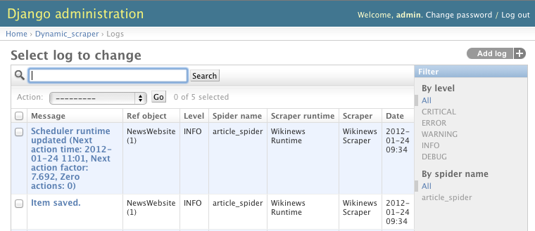
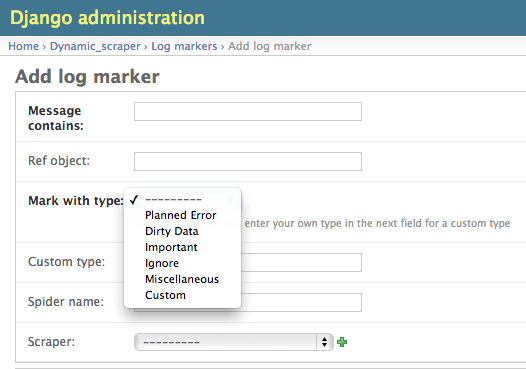
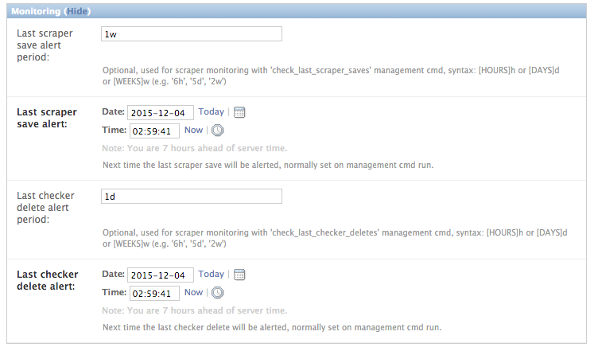
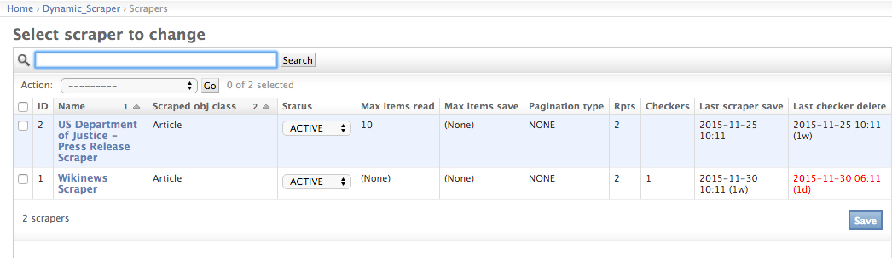

==============
Basic services
==============

.. _logging:

Logging / Log Markers
=====================

Introduction
------------
Django Dynamic Scraper provides its own logging mechanism in addition to the build-in 
`logging from Scrapy <http://doc.scrapy.org/en/latest/topics/logging.html>`_. While
the Scrapy logging is mainly for debugging your scrapers during creation time, the
DDS logging aims to get an overview how your scheduled scraper runs are doing over
time, if scrapers and checkers defined with DDS are still working and how often 
scraper or cheker runs go wrong.

In the screenshot above you see an overview of the log table in the Django admin 
in which new log messages are saved. In addition context information like the 
name of the spider run or the associated reference object or scraper
is provided. By using the filtering options it is possible to track down the
messages targeted to the actual needs, e.g. you can filter all the errors
occurred while running your checkers.

Logging: When and Where
-----------------------
When DDS scrapers are run from the command line both the logging messages from
Scrapy as well as the DDS logging messages are provided. In the Django model log
table, only the DDS messages are kept.

DDS only saves the DDS log messages in the DB when running with ``run_type=TASK``
and ``do_action=yes``. This is configuration used when running scrapers or 
checkers via the scheduler. When you run your scraper via the command line you
have to provide these options manually to have your DDS log messages saved in the DB
(see :ref:`running_scrapers`) in addition to be displayed on the screen.

Log Markers: Meaning to your logs
---------------------------------
Going through log entries and finding out what's wrong with your scrapers can be relatively tricky.
One reason for that is that not all log entries are equally meaningful. Sometimes scraping errors could
just be planned when creating the scraper, e.g. when using pagination for pages from 1 to 100, knowing
that there are no items on some pages in between, leading to "No base objects" log entries.
Or the data being scraped is a bit dirty, occasionally missing a mandatory field.

To get more meaning from your logs log markers come into play. Log markers are rules to mark all new log
entries with a special type while the log marker exists. For the pagination above you can
e.g. create a log marker, which marks all log entries as "Planned Error" type which contain the message
"No base objects" and are coming from the corresponding scraper. With creating rules for the most common
types of errors like these it becomes easier to concentrate on the potentially more severe errors by
filtering down to the "None" type entries in your logs.

.. note:: Attention! Keep in mind that log markers can only be hints to a certain source of an error.
          When looking at the pagination example above it can also be the case that a "No base objects"
          error occur on a page where there should be some items and the scraper really not working any more. 
          So be cautious!
          Log markers can only give a better orientation with your log entries and don't necessarily are
          telling the truth in all situations.

Configuration
-------------
You can configure DDS logging behaviour by providing some settings in your `settings.py`
configuration file (see :ref:`settings`).

.. _monitoring:

Monitoring
==========

Configuration
-------------

There is a montoring section in the ``DDS`` scraper admin form with basic settings which can be used to monitor scraper/checker
functionality by checking when the ``last_scraper_save`` or ``last_checker_delete`` occurred:

If ``last_scraper_save_alert_period`` or ``last_checker_delete_alert_period`` is set with an alert period in the 
format demanded it is indicated by red timestamps on the admin scraper overview page if a scraper save or checker delete
is getting too old, indicating that the scraper/checker might not be working any more.

Monitoring Automation
---------------------

You can use the following Django ``management commands`` to monitor your scrapers and checkers on a regular basis::

  python manage.py check_last_scraper_saves [--send-admin-mail] [--with-next-alert]
  python manage.py check_last_checker_deletes [--send-admin-mail] [--with-next-alert]

Standard behaviour of the commands is to check, if the last scraper save or last checker delete occured is older
than the corresponding alert period set (see configuration section above). If the ``--send-admin-mail`` flag is set
an alert mail will be send to all admin users defined in the Django ``settings.py`` file. Additionally the next
alert timestamps (see Django admin form) will be set to the current timestamp.

Practically this leads to a lot of alerts/mails (depending on the frequency of your cronjobs) once an alert
situation triggers. If you want to switch from a ``Report-Always`` to a ``Report-Once`` (more or less) behaviour
you can set the ``--with-next-alert`` flag.

This will run alert checks only for scrapers where the corresponding next alert timestamp has passed.
The timestamp is then updated by the alert period set as the earliest time for a new alert. 

An alert for a  scraper with an alert period of 2 weeks will then trigger first after the last item was scraped
more than 2 weeks ago. With the above flag, the next alert will then be earliest 2 weeks after the first alert.

.. note::
   Using the ``--with-next-alert`` flag only makes sense if your periods for your alerts are significantly 
   longer (e.g. 1 week+) than your cronjob frequency (e.g. every day).
