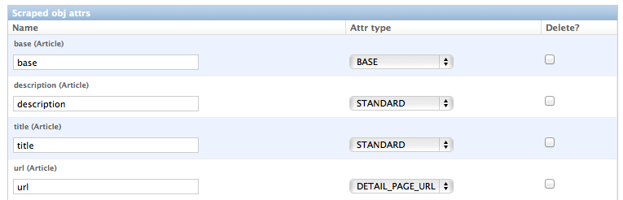
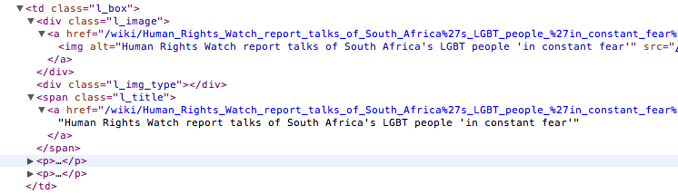
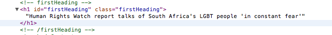
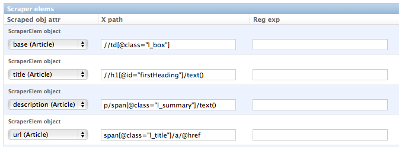
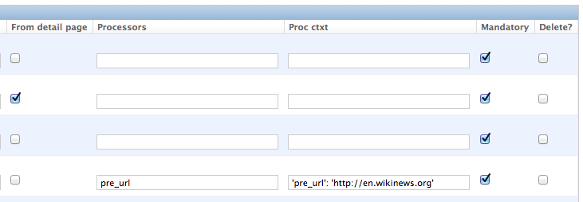
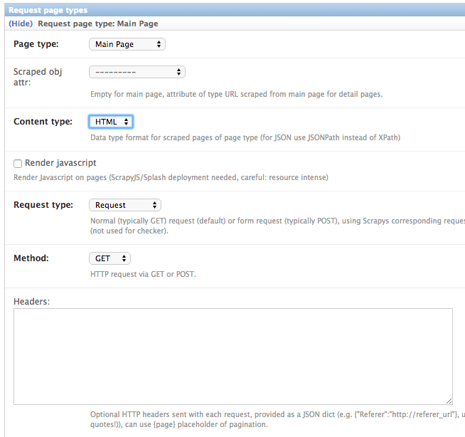
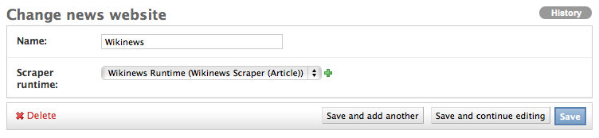
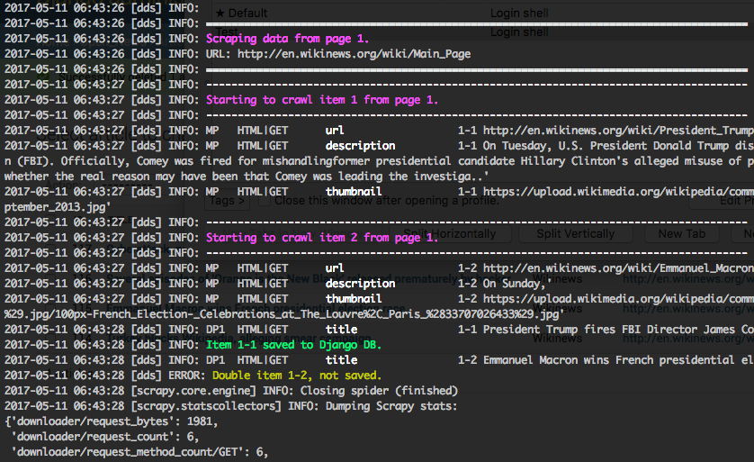
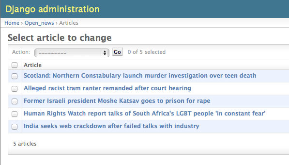

.. _getting_started:

===============
Getting started
===============

.. _Scrapy: http://www.scrapy.org 
.. _Wikinews: http://en.wikinews.org/wiki/Main_Page
.. _GitHub: https://github.com/holgerd77/django-dynamic-scraper

.. _creatingdjangomodels:

Creating your Django models
===========================

Create your model classes
-------------------------

When you want to build a Django app using Django Dynamic Scraper to fill up your models with data you have
to provide *two model classes*. The *first class* stores your scraped data, in our news example this is a
class called ``Article`` storing articles scraped from different news websites. 
The *second class* is a reference class for this first model class, defining where
the scraped items belong to. Often this class will represent a website, but it could also represent a 
category, a topic or something similar. In our news example we call the class ``NewsWebsite``. Below is the
code for this two model classes::

  from django.db import models
  from dynamic_scraper.models import Scraper, SchedulerRuntime
  from scrapy_djangoitem import DjangoItem
  
  
  class NewsWebsite(models.Model):
      name = models.CharField(max_length=200)
      url = models.URLField()
      scraper = models.ForeignKey(Scraper, blank=True, null=True, on_delete=models.SET_NULL)
      scraper_runtime = models.ForeignKey(SchedulerRuntime, blank=True, null=True, on_delete=models.SET_NULL)
      
      def __unicode__(self):
          return self.name
  
  
  class Article(models.Model):
      title = models.CharField(max_length=200)
      news_website = models.ForeignKey(NewsWebsite) 
      description = models.TextField(blank=True)
      url = models.URLField()
      checker_runtime = models.ForeignKey(SchedulerRuntime, blank=True, null=True, on_delete=models.SET_NULL)
      
      def __unicode__(self):
          return self.title
  
  
  class ArticleItem(DjangoItem):
      django_model = Article

As you can see, there are some foreign key fields defined in the models referencing DDS models.
The ``NewsWebsite`` class has a reference to the :ref:`scraper` DDS model, which contains the main
scraper with information about how to scrape the attributes of the article objects. The ``scraper_runtime``
field is a reference to the :ref:`scheduler_runtime` class from the DDS models. An object of this class stores 
scheduling information, in this case information about when to run a news website scraper for the next time. 
The ``NewsWebsite`` class also has to provide the url to be used during the scraping process. You can either
use (if existing) the representative url field of the model class, which is pointing to the nicely-layouted
overview news page also visited by the user. In this case we are choosing this way with taking the ``url``
attribute of the model class as the scrape url. However, it often makes sense to provide a dedicated ``scrape_url``
(you can name the attribute freely) field for cases, when the representative url differs from the scrape url
(e.g. if list content is loaded via ajax, or if you want to use another format of the content - e.g. the rss
feed - for scraping).

The ``Article`` class to store scraped news articles also has a reference to the :ref:`scheduler_runtime` DDS
model class called ``checker_runtime``. In this case the scheduling object holds information about the next 
existance check (using the ``url`` field from ``Article``) to evaluate if the news article
still exists or if it can be deleted (see :ref:`item_checkers`).

Last but not least: Django Dynamic Scraper uses the DjangoItem_ class from Scrapy for
being able to directly store the scraped data into the Django DB. You can store the item class 
(here: ``ArticleItem``) telling Scrapy which model class to use for storing the data directly underneath the
associated model class.

.. note::
   For having a loose coupling between your runtime objects and your domain model objects you should declare
   the foreign keys to the DDS objects with the ``blank=True, null=True, on_delete=models.SET_NULL``
   field options. This will prevent a cascading delete of your reference object as well as the associated
   scraped objects when a DDS object is deleted accidentally.

Deletion of objects
-------------------

If you delete model objects via the Django admin interface, the runtime objects are not
deleted as well. If you want this to happen, you can use Django's 
`pre_delete signals <https://docs.djangoproject.com/en/dev/topics/db/models/#overriding-model-methods>`_
in your ``models.py`` to delete e.g. the ``checker_runtime`` when deleting an article::

  @receiver(pre_delete)
  def pre_delete_handler(sender, instance, using, **kwargs):
      ....
      
      if isinstance(instance, Article):
          if instance.checker_runtime:
              instance.checker_runtime.delete()
              
  pre_delete.connect(pre_delete_handler)

.. _DjangoItem: https://scrapy.readthedocs.org/en/latest/topics/djangoitem.html

.. _defining_scraped_object_class:

Defining the object to be scraped
=================================

If you have done everything right up till now and even synced your DB :-) your Django admin should look 
similar to the following screenshot below, at least if you follow the example project:

.. image:: images/screenshot_django-admin_overview.png

Before being able to create scrapers in Django Dynamic Scraper you have to define which parts of the Django
model class you defined above should be filled by your scraper. This is done via creating a new 
:ref:`scraped_obj_class` in your Django admin interface and then adding several :ref:`scraped_obj_attr` 
datasets to it, which is done inline in the form for the :ref:`scraped_obj_class`. All attributes for the
object class which are marked as to be saved to the database have to be named like the attributes in your 
model class to be scraped. In our open news example
we want the title, the description, and the url of an Article to be scraped, so we add these attributes with
the corresponding names to the scraped obj class.

The reason why we are redefining these attributes here, is that we can later define x_path elements for each
of theses attributes dynamically in the scrapers we want to create. When Django Dynamic Scraper
is scraping items, the **general workflow of the scraping process** is as follows:

* The DDS scraper is scraping base elements from the overview page of items beeing scraped, with each base
  element encapsulating an item summary, e.g. in our open news example an article summary containing the
  title of the article, a screenshot and a short description. The encapsuling html tag often is a ``div``,
  but could also be a ``td`` tag or something else.
* If provided the DDS scraper is then scraping the url from this item summary block leading to a detail page of the
  item providing more information to scrape
* All the real item attributes (like a title, a description, a date or an image) are then scraped either from 
  within the item summary block on the overview page or from a detail page of the item. This can be defined later
  when creating the scraper itself.

To define which of the scraped obj attributes are just simple standard attributes to be scraped, which one
is the base attribute (this is a bit of an artificial construct) and which one eventually is a url to be followed
later, we have to choose an attribute type for each attribute defined. There is a choice between the following
types (taken from ``dynamic_scraper.models.ScrapedObjAttr``)::

  ATTR_TYPE_CHOICES = (
      ('S', 'STANDARD'),
      ('T', 'STANDARD (UPDATE)'),
      ('B', 'BASE'),
      ('U', 'DETAIL_PAGE_URL'),
      ('I', 'IMAGE'),
  )

``STANDARD``, ``BASE`` and ``DETAIL_PAGE_URL`` should be clear by now, ``STANDARD (UPDATE)`` behaves like ``STANDARD``, 
but these attributes are updated with the new values if the item is already in the DB. ``IMAGE`` represents attributes which will 
hold images or screenshots. So for our open news example we define a base attribute called 'base' with 
type ``BASE``, two standard elements 'title' and 'description' with type ``STANDARD`` 
and a url field called 'url' with type ``DETAIL_PAGE_URL``. Your definition form for your scraped obj class 
should look similar to the screenshot below:

To prevent double entries in the DB you also have to set one or more object attributes of type ``STANDARD`` or 
``DETAIL_PAGE_URL`` as ``ID Fields``. If you provide a ``DETAIL_PAGE_URL`` for your object scraping, it is often a
good idea to use this also as an ``ID Field``, since the different URLs for different objects should be unique by
definition in most cases. Using a single ``DETAIL_PAGE_URL`` ID field is also prerequisite if you want to use the
checker functionality (see: :ref:`item_checkers`) of DDS for dynamically detecting and deleting items not existing
any more.

Also note that these ``ID Fields`` just provide unique identification of an object for within the scraping process. In your
model class defined in the chapter above you can use other ID fields or simply use a classic numerical auto-incremented
ID provided by your database.

.. note::
   If you define an attribute as ``STANDARD (UPDATE)`` attribute and your scraper reads the value for this attribute from the detail page
   of the item, your scraping process requires **much more page requests**, because the scraper has to look at all the detail pages
   even for items already in the DB to compare the values. If you don't use the update functionality, use the simple ``STANDARD``
   attribute instead!

.. note::
   The ``order`` attribute for the different object attributes is just for convenience and determines the
   order of the attributes when used for defining ``XPaths`` in your scrapers. Use 10-based or 100-based steps
   for easier resorting (e.g. '100', '200', '300', ...).

Defining your scrapers
======================

General structure of a scraper
------------------------------

Scrapers for Django Dynamic Scraper are also defined in the Django admin interface. You first have to give the
scraper a name and select the associated :ref:`scraped_obj_class`. In our open news example we call the scraper
'Wikinews Scraper' and select the :ref:`scraped_obj_class` named 'Article' defined above.

The main part of defining a scraper in DDS is to create several scraper elements, each connected to a 
:ref:`scraped_obj_attr` from the selected :ref:`scraped_obj_class`. Each scraper element define how to extract 
the data for the specific :ref:`scraped_obj_attr` by following the main concepts of Scrapy_ for scraping
data from websites. In the fields named 'x_path' and 'reg_exp' an XPath and (optionally) a regular expression
is defined to extract the data from the page, following Scrapy's concept of 
`XPathSelectors <http://readthedocs.org/docs/scrapy/en/latest/topics/selectors.html>`_. The 'request_page_type'
select box tells the scraper, if the data for the object attibute for the scraper element should be extracted
from the overview page or a detail page of the specific item. For every chosen page type here you have to define a
corresponding request page type in the admin form above. The fields 'processors' and 'processors_ctxt' are
used to define output processors for your scraped data like they are defined in Scrapy's
`Item Loader section <http://readthedocs.org/docs/scrapy/en/latest/topics/loaders.html>`_.
You can use these processors e.g. to add a string to your scraped data or to bring a scraped date in a
common format. More on this later. Finally, the 'mandatory' check box is indicating whether the data
scraped by the scraper element is a necessary field. If you define a scraper element as necessary and no
data could be scraped for this element the item will be dropped. Note, that you always have to keep attributes
mandatory, if the corresponding attributes of your domain model class is a mandatory field, otherwise the 
scraped item can't be saved in the DB.

For the moment, keep the ``status`` to ``MANUAL`` to run the spider via the command line during this tutorial.
Later you will change it to ``ACTIVE``. 

Creating the scraper of our open news example
---------------------------------------------

Let's use the information above in the context of our Wikinews_ example. Below you see a screenshot of an
html code extract from the Wikinews_ overview page like it is displayed by the developer tools in Google's 
Chrome browser:
 

The next screenshot is from a news article detail page:

We will use these code snippets in our examples.

.. note::
  If you don't want to manually create the necessary DB objects for the example project, you can also run
  ``python manage.py loaddata open_news/open_news_dds_[DDS_VERSION].json`` from within the ``example_project`` 
  directory in your favorite shell to have all the objects necessary for the example created automatically.
  Use the file closest to the current DDS version. If you run into problems start installing the fitting
  DDS version for the fixture, then update the DDS version and apply the latest Django migrations.
  
.. note::
   The WikiNews site changes its code from time to time. I will try to update the example code and text in the
   docs, but I won't keep pace with the screenshots so they can differ slightly compared to the real world example.

1. First we have to define a base 
scraper element to get the enclosing DOM elements for news item
summaries. On the Wikinews_ overview page all news summaries are enclosed by ``<td>`` tags with a class
called 'l_box', so ``//td[@class="l_box"]`` should do the trick. We leave the rest of the field for the 
scraper element on default.

2. It is not necessary but just for the purpose of this example let's scrape the title of a news article
from the article detail page. On an article detail page the headline of the article is enclosed by a
``<h1>`` tag with an id named 'firstHeading'. So ``//h1[@id="firstHeading"]/span/text()`` should give us the headline.
Since we want to scrape from the detail page, we have to activate the 'from_detail_page' check box.

3. All the standard elements we want to scrape from the overview page are defined relative to the
base element. Therefore keep in mind to leave the trailing double slashes of XPath definitions.
We scrape the short description of a news item from within a ```` tag with a class named 'l_summary'.
So the XPath is ``p/span[@class="l_summary"]/text()``.

4. And finally the url can be scraped via the XPath ``span[@class="l_title"]/a/@href``. Since we only scrape 
the path of our url with this XPath and not the domain, we have to use a processor for the first time to complete
the url. For this purpose there is a predefined processor called 'pre_url'. You can find more predefined
processors in the ``dynamic_scraper.utils.processors`` module. 'pre_url' is simply doing what we want,
namely adding a base url string to the scraped string. To use a processor, just write the function name
in the processor field. Processors can be given some extra information via the processors_ctxt field.
In our case we need the spefic base url our scraped string should be appended to. Processor context
information is provided in a dictionary like form: ``'processor_name': 'context'``, in our case:
``'pre_url': 'http://en.wikinews.org'``. Together with our scraped string this will create
the complete url.

This completes the xpath definitions for our scraper. The form you have filled out should look similar to the screenshot above 
(which is broken down to two rows due to space issues).

.. note::
   You can also **scrape** attributes of your object **from outside the base element** by using the ``..`` notation
   in your XPath expressions to get to the parent nodes!

.. note::
   Starting with ``DDS v.0.8.11`` you can build your **detail page URLs** with
   placeholders for **main page attributes** in the form of ``{ATTRIBUTE_NAME}``, see :ref:`attribute_placeholders` for further reference.

.. _adding_request_page_types:

Adding corresponding request page types
---------------------------------------

For all page types you used for your ``ScraperElemes`` you have to define corresponding ``RequestPageType`` objects
in the ``Scraper`` admin form. There has to be exactly one main page and 0-25 detail page type objects.

Within the ``RequestPageType`` object you can define request settings like the content type (``HTML``, ``XML``,...),
the request method (``GET`` or ``POST``) and others for the specific page type. With this it is e.g. possible to 
scrape HTML content from all the main pages and ``JSON`` content from the followed detail pages. For more information
on this have a look at the :ref:`advanced_request_options` section.

Create the domain entity reference object (NewsWebsite) for our open news example
---------------------------------------------------------------------------------

Now - finally - we are just one step away of having all objects created in our Django admin.
The last dataset we have to add is the reference object of our domain, meaning a ``NewsWebsite``
object for the Wikinews Website.

To do this open the NewsWebsite form in the Django admin, give the object a meaningful name ('Wikinews'),
assign the scraper and create an empty :ref:`scheduler_runtime` object with ``SCRAPER`` as your
``runtime_type``. 

Connecting Scrapy with your Django objects
==========================================

For Scrapy to work with your Django objects we finally set up two static classes, the one being a spider class, 
inheriting from :ref:`django_spider`, the other being a finalising pipeline for saving our scraped objects.

Adding the spider class
-----------------------

The main work left to be done in our spider class - which is inheriting from the :ref:`django_spider` class
of Django Dynamic Scraper - is to instantiate the spider by connecting the domain model classes to it
in the ``__init__`` function::

  from dynamic_scraper.spiders.django_spider import DjangoSpider
  from open_news.models import NewsWebsite, Article, ArticleItem
  
  
  class ArticleSpider(DjangoSpider):
      
      name = 'article_spider'
  
      def __init__(self, *args, **kwargs):
          self._set_ref_object(NewsWebsite, **kwargs)
          self.scraper = self.ref_object.scraper
          self.scrape_url = self.ref_object.url
          self.scheduler_runtime = self.ref_object.scraper_runtime
          self.scraped_obj_class = Article
          self.scraped_obj_item_class = ArticleItem
          super(ArticleSpider, self).__init__(self, *args, **kwargs)

.. _adding_pipeline_class:

Adding the pipeline class
-------------------------

Since you maybe want to add some extra attributes to your scraped items, DDS is not saving the scraped items
for you but you have to do it manually in your own item pipeline::

  import logging
  from django.db.utils import IntegrityError
  from scrapy.exceptions import DropItem
  from dynamic_scraper.models import SchedulerRuntime
  
  class DjangoWriterPipeline(object):
      
      def process_item(self, item, spider):
        if spider.conf['DO_ACTION']: #Necessary since DDS v.0.9+
              try:
                  item['news_website'] = spider.ref_object
              
                  checker_rt = SchedulerRuntime(runtime_type='C')
                  checker_rt.save()
                  item['checker_runtime'] = checker_rt
              
                  item.save()
                  spider.action_successful = True
                  spider.log("Item saved.", logging.INFO)
                  
              except IntegrityError as e:
                  spider.log(str(e), logging.ERROR)
                  spider.log(str(item._errors), logging.ERROR)
                  raise DropItem("Missing attribute.")
        else:
            if not item.is_valid():
                spider.log(str(item._errors), logging.ERROR)
                raise DropItem("Missing attribute.")
                  
        return item 

The things you always have to do here is adding the reference object to the scraped item class and - if you
are using checker functionality - create the runtime object for the checker. You also have to set the
``action_successful`` attribute of the spider, which is used internally by DDS when the spider is closed.

.. _running_scrapers:

Running/Testing your scraper
============================

You can run/test spiders created with Django Dynamic Scraper from the command line similar to how you would run your
normal Scrapy spiders, but with some additional arguments given. The syntax of the DDS spider run command is
as following::

  scrapy crawl [--output=FILE --output-format=FORMAT] SPIDERNAME -a id=REF_OBJECT_ID 
                          [-a do_action=(yes|no) -a run_type=(TASK|SHELL) 
                          -a max_items_read={Int} -a max_items_save={Int}
                          -a max_pages_read={Int}
                          -a output_num_mp_response_bodies={Int} -a output_num_dp_response_bodies={Int} ]
  
* With ``-a id=REF_OBJECT_ID`` you provide the ID of the reference object items should be scraped for,
  in our example case that would be the Wikinews ``NewsWebsite`` object, probably with ID 1 if you haven't
  added other objects before. This argument is mandatory.
  
* By default, items scraped from the command line are not saved in the DB. If you want this to happen,
  you have to provide ``-a do_action=yes``.
  
* With ``-a run_type=(TASK|SHELL)`` you can simulate task based scraper runs invoked from the 
  command line. This can be useful for testing, just leave this argument for now.

* With ``-a max_items_read={Int}`` and ``-a max_items_save={Int}`` you can override the scraper settings for these
  params.

* With ``-a max_pages_read={Int}`` you can limit the number of pages read when using pagination

* With ``-a output_num_mp_response_bodies={Int}`` and ``-a output_num_dp_response_bodies={Int}`` you can log
  the complete response body content of the {Int} first main/detail page responses to the screen for debugging
  (beginnings/endings are marked with a unique string in the form ``RP_MP_{num}_START`` for using full-text
  search for orientation)

* If you don't want your output saved to the Django DB but to a custom file you can use Scrapy`s build-in 
  output options ``--output=FILE`` and ``--output-format=FORMAT`` to scrape items into a file. Use this without 
  setting the ``-a do_action=yes`` parameter!

So, to invoke our Wikinews scraper, we have the following command::

  scrapy crawl article_spider -a id=1 -a do_action=yes
  

If you have done everything correctly (which would be a bit unlikely for the first run after so many single steps,
but just in theory... :-)), you should get some output similar to the following, of course with other 
headlines: 

In your Django admin interface you should now see the scraped articles listed on the article overview page:

Phew.

Your first scraper with Django Dynamic Scraper is working. Not so bad! If you do a second run and there
haven't been any new bugs added to the DDS source code in the meantime, no extra article objects should be added
to the DB. If you try again later when some news articles changed on the Wikinews overview page, the new
articles should be added to the DB. 

